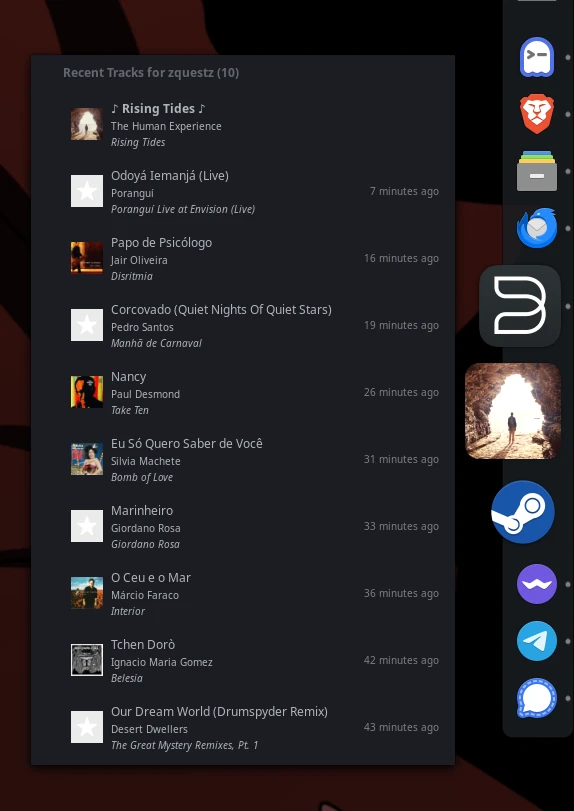

# Last.fm Docklet

A Last.fm docklet for [Plank Reloaded](https://github.com/zquestz/plank-reloaded).



## Features

- Lists recent tracks scrobbled to Last.fm

## Dependencies

- vala
- gtk+-3.0
- libsoup-3.0'
- json-glib-1.0'
- plank-reloaded

## Installation

### Method 1: Build from source

```bash
# Clone the repository
git clone https://github.com/zquestz/lastfm-docklet.git
cd lastfm-docklet

# Build and install
meson setup --prefix=/usr build
meson compile -C build
sudo meson install -C build
```

### Method 2: Arch Linux (AUR)

If you're using Arch Linux or an Arch-based distribution, you can install lastfm-docklet via the AUR:

```bash
yay -S plank-reloaded-docklet-lastfm-git
```

## Setup

After installation, open the Plank Reloaded settings, navigate to "Docklets", and drag and drop Last.fm onto your dock.

## Usage

- **Left click**: View list of recently scrobbled tracks.
- **Right click**: Adjust docklet preferences.

## License

This project is licensed under the GNU General Public License v3.0 (GPL-3.0). See the LICENSE file for details.

## Contributing

Contributions are welcome! Please feel free to submit a Pull Request.
